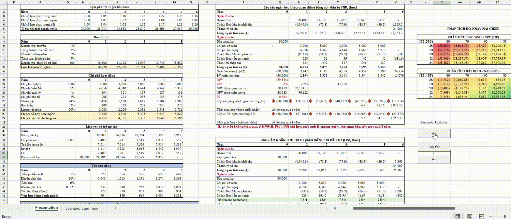
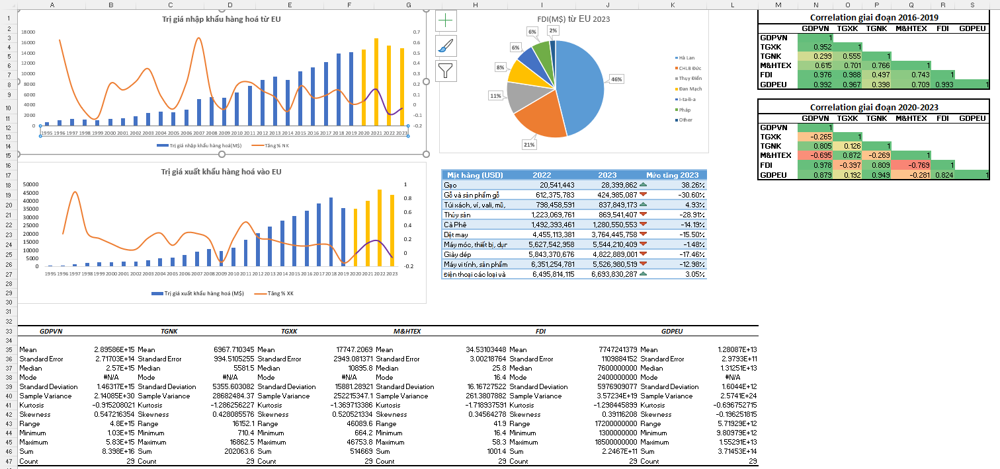
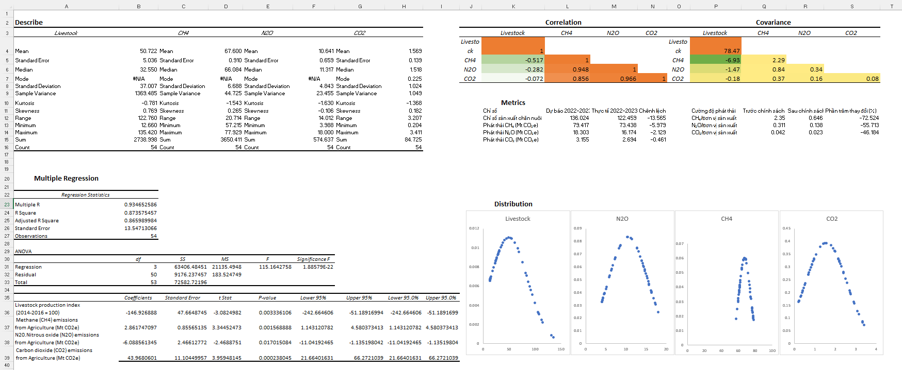

# School-Project

## [Investment Project Establishment and Appraisal](Investment_project_establishment_and_appraisal)
- **Financial Modeling & Appraisal**: Build financial appraisal reports (Cash Flow, NPV, IRR, PI, PP) under multiple perspectives (Total Investment, Investor’s Equity, Budgetary, and Economic-Social).  
- **Scenario & Sensitivity Analysis**: Develop one-way and two-way sensitivity analysis tables, apply Scenario Manager to evaluate project risks and uncertainties.  
- **Excel & VBA Automation**: Design financial models, loan repayment schedules, and automate project analysis with VBA Macros.  
- **Business Decision Support**: Transform financial insights into actionable strategies for capital management, investment evaluation, resource optimization, and decision-making.  

## [International Economics](./International_Economics)

### Evaluate Challenges & Opportunities for Vietnam in the EVFTA (Free Trade Agreement)

- **Econometric Model**: Regression of GDPVN on trade, textiles, FDI, and EU GDP.  
- **Statistical Analysis**: Descriptive analysis and regression testing.  
- **Data Modeling**: Cleaning, transformation, and PowerPivot for structured datasets.  
- **Visualization**: Charts and conditional formatting to interpret results.  

## [Environment Economics](./Enviroment_Economics)

### Analyze the Impact of Emission Reduction Policies (2022) on the Manufacturing Industry

- **Econometric Model**: Regression of Livestock Production Index on CH₄, N₂O, CO₂ emissions.  
- **Statistical Analysis**: Regression, correlation, and covariance for policy evaluation.  
- **Data Modeling**: Cleaning, transformation, and PowerPivot for structured analysis.  
- **Visualization**: Charts, conditional formatting, and dashboards to highlight insights.  

